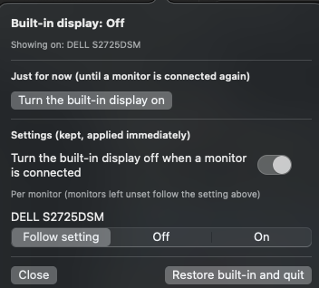

# KeepLidOpen

[](https://github.com/sean-from-japan/KeepLidOpen/actions/workflows/ci.yml)

Use a MacBook with the lid open and only the external monitor, keeping the
built-in keyboard, Touch ID, camera and better cooling. KeepLidOpen switches the
built-in display off when a monitor is connected and brings it back when the
monitor goes away, so the Mac is never left with a black screen.

[日本語の説明はこちら](#日本語)



> **If the screen goes black:** plug the monitor back in, or close and reopen
> the lid, or log out (the "off" state lasts for the login session only). Then
> run `scripts/uninstall.sh` if you want to remove the app. KeepLidOpen uses
> private macOS APIs; see [Caveats](#caveats).

## Why not brightness 0 or mirroring?

At brightness 0 the panel is still a display: windows, the cursor and the Dock
can land on it, and on some Macs the backlight does not go fully dark.
Mirroring stops that but has to be set up again each time. KeepLidOpen
disconnects the panel in software, the way unplugging a monitor would.

## Features

- **One setting for all monitors** (default): the built-in turns off whenever a
  monitor is connected.
- **Per-monitor settings**, optional: follow the setting, always off, or always
  on (e.g. keep the built-in on for a projector). With several monitors
  connected, one that keeps the built-in on wins.
- **Just for now**: switch the built-in on or off until a monitor is connected
  again, without changing the settings.
- **Recovery**: when the last monitor is unplugged or powered off, the built-in
  comes back, including the cases in [docs/FINDINGS.md](docs/FINDINGS.md)
  where the display list is empty or holds only a placeholder.
- The panel stays open while you click it and while you use other apps; close it
  with its icon, the Close button or Esc.
- Settings apply immediately, from the panel or the command line.

## Install

Requires macOS 13 or later and the Command Line Tools (`xcode-select --install`).
Tested only on a MacBook Air (M5) with macOS 26.6.2.

```sh
git clone https://github.com/sean-from-japan/KeepLidOpen.git
cd KeepLidOpen
scripts/test.sh      # decision logic tests
scripts/install.sh   # builds, copies to ~/Applications, starts at login
```

`install.sh` builds `KeepLidOpen.app`, signs it ad hoc, copies it to
`~/Applications` and registers a launchd agent that starts it at login and
restarts it after a crash. Opening the app from Finder or Spotlight hands over
to that agent, or shows the panel if it is already running.

If `swiftc` reports that the SDK was built with a different compiler version,
build against another installed SDK:

```sh
SDKROOT=/Library/Developer/CommandLineTools/SDKs/MacOSX15.4.sdk scripts/install.sh
```

To remove it: `scripts/uninstall.sh` (quitting turns the built-in back on first).

## Command line

The running app picks up changes within about two seconds and applies them.

```sh
id=io.github.sean-from-japan.KeepLidOpen
defaults write $id autoOffOnConnect -bool false        # all monitors: keep the built-in on
defaults write $id autoOffOnConnect -bool true         # all monitors: built-in off
defaults write $id perDisplay -dict-add <key> on       # one monitor: keep the built-in on
defaults delete $id perDisplay                         # all monitors follow the setting
defaults write $id AppleLanguages -array ja            # Japanese panel (or en)
```

Monitor keys are written to `~/Library/Logs/KeepLidOpen.log` as
`monitors: <name> <key>`.

## How it works

The built-in is switched with the private SkyLight function
`CGSConfigureDisplayEnabled`, and found with `CGSGetDisplayList`, which unlike
the public lists still shows a disabled display. "Off" is committed for the
login session only and "on" permanently. The app watches display
reconfiguration callbacks, sleep and wake, and a 2-second timer.

What macOS actually did during unplugs, power-offs and display sleep, and the
design decisions that follow, are in [docs/FINDINGS.md](docs/FINDINGS.md).
The decisions themselves are in `Sources/Logic.swift` and tested in
`Tests/main.swift`, including one test for each failure met while building it.

## Caveats

- Private APIs can change in any macOS update. If the SkyLight symbols are
  missing, the app starts but switches nothing and says so in its log.
- Tested on one Mac and one monitor. Another tool reports that re-enabling the
  built-in can hang WindowServer on base M3 MacBooks; KeepLidOpen has not been
  tried there.
- Not notarized: it is built on your Mac from source.

## Related projects

- [SoloDisplay](https://github.com/fanckush/SoloDisplay): the same idea with a
  signed DMG, Homebrew cask and automatic updates. Choose it if you want an
  installer; KeepLidOpen focuses on per-monitor settings, a "just for now"
  switch and documented recovery behaviour.
- [NoLid](https://github.com/NicolasMarino/nolid),
  [blackoutd](https://github.com/toobuntu/blackoutd),
  [InternalDisplayOff](https://github.com/RonaldPark89/InternalDisplayOff) and
  [MacDisplay](https://github.com/jjongkwann/MacDisplay): open-source tools for
  the same private API.
- [BetterDisplay](https://github.com/waydabber/BetterDisplay) (Pro),
  [Lunar](https://lunar.fyi) (BlackOut) and Unlit: commercial apps.

KeepLidOpen was written independently and contains no code from these projects.

## License

[MIT](LICENSE)

---

## 日本語

MacBookのふたを開けたまま、外部モニターだけで使うためのメニューバーアプリです。内蔵キーボード、Touch ID、カメラをそのまま使えて、ふたを閉じるよりも熱がこもりにくくなります。モニターをつなぐと内蔵画面を切り、モニターが外れると内蔵画面を戻します。

> **画面が真っ暗になったとき:** モニターをつなぎ直すか、ふたを一度閉じて開けるか、ログアウトしてください（オフの状態はログイン中だけ有効です）。アプリを外すときは `scripts/uninstall.sh` を実行してください。

### 明るさを0にするのと何が違うのか

明るさを0にしても、内蔵画面はmacOSにとって画面のままです。ウィンドウやカーソル、Dockが見えない画面に移ってしまいますし、機種によってはバックライトが完全には消えません。ミラーリングにすればウィンドウは移りませんが、つなぐたびに設定し直す必要があります。KeepLidOpenは、モニターを抜いたときと同じように、内蔵画面をソフトウェアで切り離します。

### できること

- **全体の設定**（初期状態）: モニターをつなぐと内蔵画面をオフにします。
- **モニターごとの設定**（任意）: 「上の設定に従う」「オフ」「オン」から選べます。プロジェクターだけ内蔵画面を残す、といった使い方ができます。複数のモニターをつないでいるときは、1台でも「オン」なら内蔵画面を点けます。
- **今だけ**: 設定を変えずに、次にモニターをつなぐまで内蔵画面をオン・オフします。
- **復旧**: 最後のモニターを抜いたとき、または電源を切ったときに内蔵画面を戻します。画面の一覧が空になる場合や、実体のない仮の画面だけが残る場合も含みます（[docs/FINDINGS.md](docs/FINDINGS.md)）。
- パネルはボタンを押しても、ほかのアプリを使っても閉じません。アイコン、「閉じる」ボタン、Escキーで閉じます。
- 設定はパネルからでもコマンドラインからでも変えられ、変えるとすぐに反映されます。

### 導入

macOS 13以降とCommand Line Tools（`xcode-select --install`）が必要です。動作を確認したのはMacBook Air（M5）とmacOS 26.6.2の組み合わせだけです。

```sh
git clone https://github.com/sean-from-japan/KeepLidOpen.git
cd KeepLidOpen
scripts/test.sh
scripts/install.sh
```

`install.sh` はアプリをビルドして `~/Applications` に置き、ログイン時に起動するlaunchdエージェントを登録します。異常終了したときも自動で起動し直します。パネルを日本語にするときは次のコマンドを実行してください（macOSの言語が日本語なら不要です）。

```sh
defaults write io.github.sean-from-japan.KeepLidOpen AppleLanguages -array ja
```

`swiftc` がSDKのコンパイラのバージョン違いを報告したときは、`SDKROOT` で別のSDKを指定してください（上の英語の節に例があります）。

### 注意

- macOSの非公開APIを使っているため、macOSの更新で動かなくなる可能性があります。
- 試したのは1台のMacと1台のモニターだけです。M3の無印モデルでは、内蔵画面を戻すときにWindowServerが止まるという報告がほかのツールで出ています。
- 公証（notarization）は受けていません。各自のMacでソースからビルドする形です。

### 似たツール

インストーラーと自動更新が必要なら [SoloDisplay](https://github.com/fanckush/SoloDisplay) が向いています。KeepLidOpenはモニターごとの設定、「今だけ」の切り替え、復旧の挙動を記録した資料に重点を置いています。コードはこれらのプロジェクトから流用していません。
